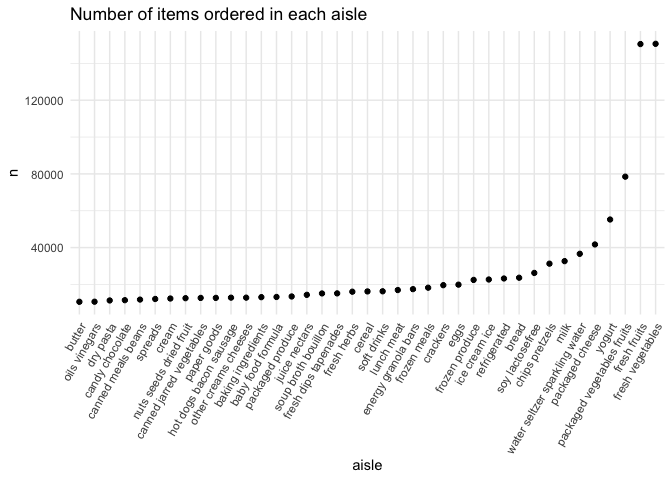

Data Science HW-3
================
Kasturi Bhamidipati
2022-10-13

First we will load the packages that we need!

``` r
library(tidyverse)
```

    ## ── Attaching packages ─────────────────────────────────────── tidyverse 1.3.2 ──
    ## ✔ ggplot2 3.3.6      ✔ purrr   0.3.4 
    ## ✔ tibble  3.1.8      ✔ dplyr   1.0.10
    ## ✔ tidyr   1.2.0      ✔ stringr 1.4.1 
    ## ✔ readr   2.1.2      ✔ forcats 0.5.2 
    ## ── Conflicts ────────────────────────────────────────── tidyverse_conflicts() ──
    ## ✖ dplyr::filter() masks stats::filter()
    ## ✖ dplyr::lag()    masks stats::lag()

``` r
library(ggridges)
library(skimr)
library(patchwork)
library(p8105.datasets)

knitr::opts_chunk$set(
    echo = TRUE,
    warning = FALSE
)

theme_set(theme_minimal() + theme(legend.position = "bottom"))

options(
  ggplot2.continuous.colour = "viridis",
  ggplot2.continuous.fill = "viridis"
)

scale_colour_discrete = scale_colour_viridis_d
scale_fill_discrete = scale_fill_viridis_d
```

# Problem 1

#### Read in the data

``` r
data("instacart")

instacart = 
  instacart %>% 
  as_tibble(instacart)
```

#### Answer questions about the data

This dataset contains 1384617 rows and 15 columns, with each row
resprenting a single product from an instacart order. Variables include
identifiers for user, order, and product; the order in which each
product was added to the cart. There are several order-level variables,
describing the day and time of the order, and number of days since prior
order. Then there are several item-specific variables, describing the
product name (e.g. Yogurt, Avocado), department (e.g. dairy and eggs,
produce), and aisle (e.g. yogurt, fresh fruits), and whether the item
has been ordered by this user in the past. In total, there are 39123
products found in 131209 orders from 131209 distinct users.

Below is a table summarizing the number of items ordered from aisle. In
total, there are 134 aisles, with fresh vegetables and fresh fruits
holding the most items ordered by far.

``` r
instacart %>% 
  count(aisle) %>% 
  arrange(desc(n))
```

    ## # A tibble: 134 × 2
    ##    aisle                              n
    ##    <chr>                          <int>
    ##  1 fresh vegetables              150609
    ##  2 fresh fruits                  150473
    ##  3 packaged vegetables fruits     78493
    ##  4 yogurt                         55240
    ##  5 packaged cheese                41699
    ##  6 water seltzer sparkling water  36617
    ##  7 milk                           32644
    ##  8 chips pretzels                 31269
    ##  9 soy lactosefree                26240
    ## 10 bread                          23635
    ## # … with 124 more rows

Next is a plot that shows the number of items ordered in each aisle.
Here, aisles are ordered by ascending number of items.

``` r
instacart %>% 
  count(aisle) %>% 
  filter(n > 10000) %>% 
  mutate(aisle = fct_reorder(aisle, n)) %>% 
  ggplot(aes(x = aisle, y = n)) + 
  geom_point() + 
  labs(title = "Number of items ordered in each aisle") +
  theme(axis.text.x = element_text(angle = 60, hjust = 1))
```

<!-- -->

Our next table shows the three most popular items in aisles
`baking ingredients`, `dog food care`, and `packaged vegetables fruits`,
and includes the number of times each item is ordered in your table.

``` r
instacart %>% 
  filter(aisle %in% c("baking ingredients", "dog food care", "packaged vegetables fruits")) %>%
  group_by(aisle) %>% 
  count(product_name) %>% 
  mutate(rank = min_rank(desc(n))) %>% 
  filter(rank < 4) %>% 
  arrange(desc(n)) %>%
  knitr::kable()
```

| aisle                      | product_name                                  |    n | rank |
|:---------------------------|:----------------------------------------------|-----:|-----:|
| packaged vegetables fruits | Organic Baby Spinach                          | 9784 |    1 |
| packaged vegetables fruits | Organic Raspberries                           | 5546 |    2 |
| packaged vegetables fruits | Organic Blueberries                           | 4966 |    3 |
| baking ingredients         | Light Brown Sugar                             |  499 |    1 |
| baking ingredients         | Pure Baking Soda                              |  387 |    2 |
| baking ingredients         | Cane Sugar                                    |  336 |    3 |
| dog food care              | Snack Sticks Chicken & Rice Recipe Dog Treats |   30 |    1 |
| dog food care              | Organix Chicken & Brown Rice Recipe           |   28 |    2 |
| dog food care              | Small Dog Biscuits                            |   26 |    3 |

Finally is a table showing the mean hour of the day at which Pink Lady
Apples and Coffee Ice Cream are ordered on each day of the week. This
table has been formatted in an untidy manner for human readers. Pink
Lady Apples are generally purchased slightly earlier in the day than
Coffee Ice Cream, with the exception of day 5.

``` r
instacart %>%
  filter(product_name %in% c("Pink Lady Apples", "Coffee Ice Cream")) %>%
  group_by(product_name, order_dow) %>%
  summarize(mean_hour = mean(order_hour_of_day)) %>%
  spread(key = order_dow, value = mean_hour) %>%
  knitr::kable(digits = 2)
```

    ## `summarise()` has grouped output by 'product_name'. You can override using the
    ## `.groups` argument.

| product_name     |     0 |     1 |     2 |     3 |     4 |     5 |     6 |
|:-----------------|------:|------:|------:|------:|------:|------:|------:|
| Coffee Ice Cream | 13.77 | 14.32 | 15.38 | 15.32 | 15.22 | 12.26 | 13.83 |
| Pink Lady Apples | 13.44 | 11.36 | 11.70 | 14.25 | 11.55 | 12.78 | 11.94 |

# Problem 2

We need to load and tidy the dataset.

``` r
accel_data = 
  read_csv(
    "data/accel_data.csv")%>% 
  janitor::clean_names() %>% 
  pivot_longer(
    activity_1:activity_1440,
    names_to = "minute", 
    names_prefix = "activity_",
    values_to = "activity"
    ) %>% 
  mutate( minute = as.numeric(minute),
          day_of_the_week = 
            recode(day,
                 "Monday" = "Weekday", 
                 "Tuesday" = "Weekday",
                 "Wednesday" = "Weekday", 
                 "Thursday" = "Weekday", 
                 "Friday"= "Weekday", 
                 "Saturday" = "Weekend", 
                 "Sunday"= "Weekend"
                   )
  )
```

    ## Rows: 35 Columns: 1443
    ## ── Column specification ────────────────────────────────────────────────────────
    ## Delimiter: ","
    ## chr    (1): day
    ## dbl (1442): week, day_id, activity.1, activity.2, activity.3, activity.4, ac...
    ## 
    ## ℹ Use `spec()` to retrieve the full column specification for this data.
    ## ℹ Specify the column types or set `show_col_types = FALSE` to quiet this message.

### Summary of the `accel_data` dataset

This is the `accel_data` dataset.

|                                                  |            |
|:-------------------------------------------------|:-----------|
| Name                                             | accel_data |
| Number of rows                                   | 50400      |
| Number of columns                                | 6          |
| \_\_\_\_\_\_\_\_\_\_\_\_\_\_\_\_\_\_\_\_\_\_\_   |            |
| Column type frequency:                           |            |
| character                                        | 2          |
| numeric                                          | 4          |
| \_\_\_\_\_\_\_\_\_\_\_\_\_\_\_\_\_\_\_\_\_\_\_\_ |            |
| Group variables                                  | None       |

Data summary

**Variable type: character**

| skim_variable   | n_missing | complete_rate | min | max | empty | n_unique | whitespace |
|:----------------|----------:|--------------:|----:|----:|------:|---------:|-----------:|
| day             |         0 |             1 |   6 |   9 |     0 |        7 |          0 |
| day_of_the_week |         0 |             1 |   7 |   7 |     0 |        2 |          0 |

**Variable type: numeric**

| skim_variable | n_missing | complete_rate |   mean |     sd |  p0 |    p25 |   p50 |     p75 | p100 | hist  |
|:--------------|----------:|--------------:|-------:|-------:|----:|-------:|------:|--------:|-----:|:------|
| week          |         0 |             1 |   3.00 |   1.41 |   1 |   2.00 |   3.0 |    4.00 |    5 | ▇▇▇▇▇ |
| day_id        |         0 |             1 |  18.00 |  10.10 |   1 |   9.00 |  18.0 |   27.00 |   35 | ▇▇▇▇▇ |
| minute        |         0 |             1 | 720.50 | 415.70 |   1 | 360.75 | 720.5 | 1080.25 | 1440 | ▇▇▇▇▇ |
| activity      |         0 |             1 | 267.04 | 443.16 |   1 |   1.00 |  74.0 |  364.00 | 8982 | ▇▁▁▁▁ |

-   It consists of 50400 rows and 6 columns.

-   The dataset gives us information on the the day of the exercise, the
    minute of the day, the activity count, a unique `day_ID` variable
    for each day, a variable categorizing the days into either weekdays
    or weekends and the week number.

### Total Acitivity - Traditional Analysis

Here we have the code chunk to calculate total activity per day, across
the different weeks.

``` r
traditional_anal = 
  accel_data %>% 
  group_by(week, day) %>%
  summarise(total_activity = sum(activity)) %>%
  pivot_wider(
    names_from = day, 
    values_from = total_activity
  ) %>%
  select("week","Monday", "Tuesday", "Wednesday", "Thursday", "Friday", "Saturday", "Sunday")
```

    ## `summarise()` has grouped output by 'week'. You can override using the
    ## `.groups` argument.

Yes, there are trends that are apparent. I notice that, on average, the
total activity during the weekdays is more than that of the weekends. I
also find some irregular/potentially wrong data values because in weeks
4 and 5, the total activity on Saturday is extremely low, which ideally
should not be the case.

### Single Panel Plot

``` r
  accel_data %>%
  ggplot(aes(x = minute/60, y = activity, color = day))+
  geom_line(alpha = .30)+ 
  geom_point(alpha = .30)+ 
  geom_smooth( aes(group = day,se = FALSE))+
  labs(
    title = "24-hour Activity Time Courses For Each Day", 
    x = "Hour", 
    y = "Activity"
  )+
  theme_bw()
```

    ## `geom_smooth()` using method = 'gam' and formula 'y ~ s(x, bs = "cs")'

<!-- -->

From the plot I observed that the individual had maximum activity from
10am to 10pm. Post 10pm, the activity starts to decline, however we see
steady activity counts for most part of the day. I also observed that on
Friday, Saturday and Sunday, we see some peaks in activity counts.
Mostly however, throughout the week, we see a pretty uniform trend in
activity, wherein there is more activity during the day (assuming that
this is when the individual is awake), and declining acitivity during
the night (probably when the individual is asleep).

# Problem 3

First we want to load the package.

``` r
data("ny_noaa")
```

### Summary of `ny_noaa` dataset

This is the `ny_noaa` dataset.

|                                                  |         |
|:-------------------------------------------------|:--------|
| Name                                             | ny_noaa |
| Number of rows                                   | 2595176 |
| Number of columns                                | 7       |
| \_\_\_\_\_\_\_\_\_\_\_\_\_\_\_\_\_\_\_\_\_\_\_   |         |
| Column type frequency:                           |         |
| character                                        | 3       |
| Date                                             | 1       |
| numeric                                          | 3       |
| \_\_\_\_\_\_\_\_\_\_\_\_\_\_\_\_\_\_\_\_\_\_\_\_ |         |
| Group variables                                  | None    |

Data summary

**Variable type: character**

| skim_variable | n_missing | complete_rate | min | max | empty | n_unique | whitespace |
|:--------------|----------:|--------------:|----:|----:|------:|---------:|-----------:|
| id            |         0 |          1.00 |  11 |  11 |     0 |      747 |          0 |
| tmax          |   1134358 |          0.56 |   1 |   4 |     0 |      532 |          0 |
| tmin          |   1134420 |          0.56 |   1 |   4 |     0 |      548 |          0 |

**Variable type: Date**

| skim_variable | n_missing | complete_rate | min        | max        | median     | n_unique |
|:--------------|----------:|--------------:|:-----------|:-----------|:-----------|---------:|
| date          |         0 |             1 | 1981-01-01 | 2010-12-31 | 1997-01-21 |    10957 |

**Variable type: numeric**

| skim_variable | n_missing | complete_rate |  mean |     sd |  p0 | p25 | p50 | p75 |  p100 | hist  |
|:--------------|----------:|--------------:|------:|-------:|----:|----:|----:|----:|------:|:------|
| prcp          |    145838 |          0.94 | 29.82 |  78.18 |   0 |   0 |   0 |  23 | 22860 | ▇▁▁▁▁ |
| snow          |    381221 |          0.85 |  4.99 |  27.22 | -13 |   0 |   0 |   0 | 10160 | ▇▁▁▁▁ |
| snwd          |    591786 |          0.77 | 37.31 | 113.54 |   0 |   0 |   0 |   0 |  9195 | ▇▁▁▁▁ |

-   It has 2595176 rows and 7 columns.

-   The dataset gives us information on precipitation, snow fall, snow
    depth, maximum and minimum temperatures on a specific day, in New
    York State. It also gives us information on the weather station ID
    through which the data was collected.

-   It includes the years 1981 to 2010.

### Cleaning the dataset

``` r
nys_weather = 
  ny_noaa %>%
  janitor::clean_names() %>%
  separate(date, into = c("year", "month", "day"), sep = "-", convert = TRUE)%>%
  mutate(month = month.abb[month], 
         prcp = prcp/10, 
         tmax = as.numeric(tmax),
         tmin = as.numeric(tmin)
  ) %>% 
  select(id, day, month, year, everything()) %>% 
  mutate(
    tmax = tmax/10,
    tmin = tmin/10
    )
```

The most commonly observed values for snowfall are 0s. I assume this is
because on most days there was no snowfall recorded. It also makes sense
because it does not snow for a large portion of the year, and so the
days where we actually have snowfall make up a very small portion of the
data in comparison to no snowfall days.

### Two-Panel Plot - Average Max Temp

``` r
max_temp= 
  nys_weather %>%
  group_by(id, month, year) %>%
  filter(month %in% c("Jan","Jul")) %>%
  summarise(tmax_avg = mean(tmax, na.rm = TRUE)) %>% 
  ggplot(aes(x = year, y = tmax_avg, colour = id))+
    geom_line(alpha=.25)+
    theme(legend.position = "none", axis.text.x = element_text(angle = 60, hjust = 1))+
    facet_grid(.~ month)+
    labs(
    title = "Average max Temperature in January and July (C)",
    x = "Year",
    y = "Average Max Temperature (C)"
    )
```

    ## `summarise()` has grouped output by 'id', 'month'. You can override using the
    ## `.groups` argument.

``` r
max_temp
```

<!-- -->

From the plots, I observe that there are lower average maximum
temperature in January than in July. However, we do also have some
outliers that I can notice from this graph. This could be because some
of the weather stations reporter unusually lower/higher average maximum
temperatures at some point during the years that were included in this
dataset.

### Two-Panel Plot - `tmax` vs. `tmin` and Snowfall

\`

``` r
tmax_tmin_p = 
  nys_weather %>% 
  ggplot(aes(x = tmax, y = tmin))+
  geom_hex()+
  theme(legend.position = "right")+
  labs(
    title = "tmax vs. tmin",
    x = "tmax (C)",
    y = "tmin (C)"
    )
  

snowfall= 
  nys_weather %>% 
  group_by(year) %>%
  filter(snow %in% (1:99)) %>%
  ggplot(aes(x = snow, y = as.factor(year))) + 
  geom_density_ridges()+
  theme(legend.position = "none")+ 
  labs(
    title = "Distribution of Snowfall (mm) from 1981-2010 in NYS",
    x = "Snowfall (mm)",
    y = "Year"
    )


tmax_tmin_p + snowfall
```

    ## Picking joint bandwidth of 3.76

<!-- -->
