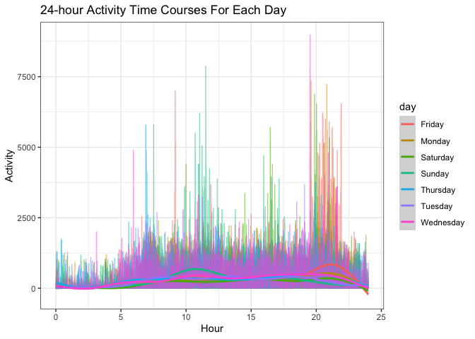

Viz and EDA
================
Kasturi Bhamidipati
2022-10-13

First we will load the packages that we need!

``` r
library(tidyverse)
```

    ## ── Attaching packages ─────────────────────────────────────── tidyverse 1.3.2 ──
    ## ✔ ggplot2 3.3.6      ✔ purrr   0.3.4 
    ## ✔ tibble  3.1.8      ✔ dplyr   1.0.10
    ## ✔ tidyr   1.2.0      ✔ stringr 1.4.1 
    ## ✔ readr   2.1.2      ✔ forcats 0.5.2 
    ## ── Conflicts ────────────────────────────────────────── tidyverse_conflicts() ──
    ## ✖ dplyr::filter() masks stats::filter()
    ## ✖ dplyr::lag()    masks stats::lag()

``` r
library(ggridges)
library(p8105.datasets)
library(skimr)
```

# Problem 2

We need to load and tidy the dataset.

``` r
accel_data = 
  read_csv(
    "data/accel_data.csv")%>% 
  janitor::clean_names() %>% 
  pivot_longer(
    activity_1:activity_1440,
    names_to = "minute", 
    names_prefix = "activity_",
    values_to = "activity"
    ) %>% 
  mutate( minute = as.numeric(minute),
          day_of_the_week = 
            recode(day,
                 "Monday" = "Weekday", 
                 "Tuesday" = "Weekday",
                 "Wednesday" = "Weekday", 
                 "Thursday" = "Weekday", 
                 "Friday"= "Weekday", 
                 "Saturday" = "Weekend", 
                 "Sunday"= "Weekend"
                   )
  )
```

    ## Rows: 35 Columns: 1443
    ## ── Column specification ────────────────────────────────────────────────────────
    ## Delimiter: ","
    ## chr    (1): day
    ## dbl (1442): week, day_id, activity.1, activity.2, activity.3, activity.4, ac...
    ## 
    ## ℹ Use `spec()` to retrieve the full column specification for this data.
    ## ℹ Specify the column types or set `show_col_types = FALSE` to quiet this message.

### Summary of the `accel_data` dataset

This is the `accel_data` dataset.

|                                                  |            |
|:-------------------------------------------------|:-----------|
| Name                                             | accel_data |
| Number of rows                                   | 50400      |
| Number of columns                                | 6          |
| \_\_\_\_\_\_\_\_\_\_\_\_\_\_\_\_\_\_\_\_\_\_\_   |            |
| Column type frequency:                           |            |
| character                                        | 2          |
| numeric                                          | 4          |
| \_\_\_\_\_\_\_\_\_\_\_\_\_\_\_\_\_\_\_\_\_\_\_\_ |            |
| Group variables                                  | None       |

Data summary

**Variable type: character**

| skim_variable   | n_missing | complete_rate | min | max | empty | n_unique | whitespace |
|:----------------|----------:|--------------:|----:|----:|------:|---------:|-----------:|
| day             |         0 |             1 |   6 |   9 |     0 |        7 |          0 |
| day_of_the_week |         0 |             1 |   7 |   7 |     0 |        2 |          0 |

**Variable type: numeric**

| skim_variable | n_missing | complete_rate |   mean |     sd |  p0 |    p25 |   p50 |     p75 | p100 | hist  |
|:--------------|----------:|--------------:|-------:|-------:|----:|-------:|------:|--------:|-----:|:------|
| week          |         0 |             1 |   3.00 |   1.41 |   1 |   2.00 |   3.0 |    4.00 |    5 | ▇▇▇▇▇ |
| day_id        |         0 |             1 |  18.00 |  10.10 |   1 |   9.00 |  18.0 |   27.00 |   35 | ▇▇▇▇▇ |
| minute        |         0 |             1 | 720.50 | 415.70 |   1 | 360.75 | 720.5 | 1080.25 | 1440 | ▇▇▇▇▇ |
| activity      |         0 |             1 | 267.04 | 443.16 |   1 |   1.00 |  74.0 |  364.00 | 8982 | ▇▁▁▁▁ |

-   It consists of 50400 rows and 6 columns.

-   The dataset gives us information on the the day of the exercise, the
    minute of the day, the activity count, a unique `day_ID` variable
    for each day, a variable categorizing the days into either weekdays
    or weekends and the week number.

### Total Acitivity - Traditional Analysis

Here we have the code chunk to calculate total activity per day, across
the different weeks.

``` r
traditional_anal = 
  accel_data %>% 
  group_by(week, day) %>%
  summarise(total_activity = sum(activity)) %>%
  pivot_wider(
    names_from = day, 
    values_from = total_activity
  ) %>%
  select("week","Monday", "Tuesday", "Wednesday", "Thursday", "Friday", "Saturday", "Sunday")
```

    ## `summarise()` has grouped output by 'week'. You can override using the
    ## `.groups` argument.

Yes, there are trends that are apparent. I notice that, on average, the
total activity during the weekdays is more than that of the weekends. I
also find some irregular/potentially wrong data values because in weeks
4 and 5, the total activity on Saturday is extremely low, which ideally
should not be the case.

### Single Panel Plot

``` r
  accel_data %>%
  ggplot(aes(x = minute/60, y = activity, color = day))+
  geom_line(alpha = .5)+ 
  geom_smooth( aes(group = day,se = FALSE))+ 
  labs(
    title = "24-hour Activity Time Courses For Each Day", 
    x = "Hour", 
    y = "Activity"
  )+
  theme_bw()
```

    ## `geom_smooth()` using method = 'gam' and formula 'y ~ s(x, bs = "cs")'

<!-- -->

What do we say about this?????

# Problem 3
